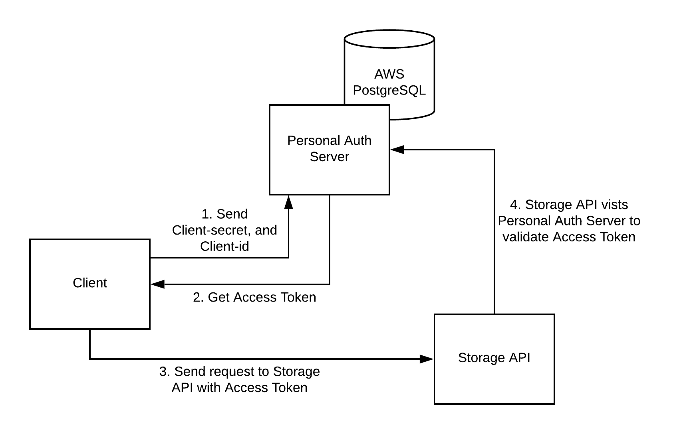

# storage-api
The downstream api for other microservices to access the personal storage server.

## feature/personal-oauth2-resource-01
This is the branch uses [personal-oauth2-server](https://github.com/paper-driver/personal-oauth2-server/tree/feature/client-credential-2) to validate any client's identity to 
secure the communication.

(05/25) - Add file saving and loading functionality but currently all users share the same storage location.

This resource server uses old Spring Boot 2.

### Access Flow

